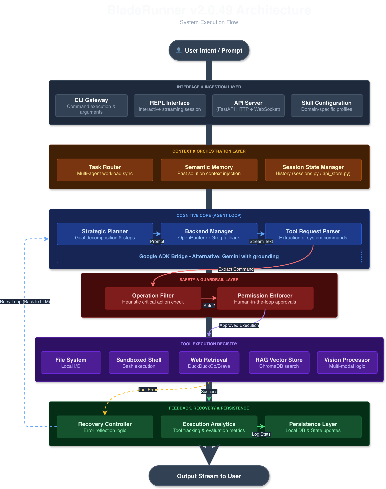

# BladeRunner v2.0.49

[](#)

**Execute orders like a Replicant. Retire the manual.**

[](...)
[](https://github.com/astral-sh/uv)
[](...)
[](https://mypy-lang.org/)
[](https://github.com/mann-127/BladeRunner/actions)
[](#)
[](https://opensource.org/licenses/MIT)

---

## Table Of Contents

- [Overview](#-overview)
- [System Architecture](#-system-architecture)
- [Agentic AI Features](#-agentic-ai-features)
- [Key Features](#-key-features)
- [Quick Start](#-quick-start)
- [Development And Testing](#-development--testing)
- [Use Cases](#-use-cases)
- [Configuration](#-configuration)
- [Why This Matters](#-why-this-matters)

---

## 🎯 Overview

BladeRunner transforms natural language prompts into executed code and system operations through an intelligent agent architecture. Whether you're prototyping, debugging, or automating development workflows, BladeRunner provides the tools and safety guardrails you need.

### Why BladeRunner?

- **🏗️ Production-Ready**: Modular architecture designed for real-world use
- **🔒 Secure**: Three-profile permission system with command filtering
- **💾 Persistent**: Session management for multi-turn conversations
- **🌐 Connected**: Web search for real-time information
- **👁️ Multimodal**: Vision capabilities for image analysis
- **🎨 Flexible**: Modular tool system and skills framework
- **⚡ Fast**: Support for multiple models (Claude, Llama, Gemini, Mistral, and more)

---

## 🏗️ System Architecture



**Architecture Overview:**
The diagram above represents the logical execution pipeline of `bladerunner/agent.py`. The broad, gray background lines represent the macro-stages of the request, while the thin colored lines represent the granular data hand-offs between the components.

Editable source diagrams are versioned in `docs/ARCHITECTURE (light).drawio` and `docs/ARCHITECTURE (dark).drawio`.

**The Execution Lifecycle (`execute()`):**
1. **Ingestion:** User prompts enter through `cli.py`, `interactive.py`, or `api_server.py` (HTTP/WebSocket API).
2. **Context Compilation:** Before contacting the LLM, the `agent_orchestrator.py` selects an identity, `semantic_memory.py` injects similar successful past code, and `sessions.py` (or `api_store.py` for API mode) loads the ongoing conversation history.
3. **Core Generation:** The strategic planner inside `agent.py` formats the compiled context. The `backend_manager.py` handles automatic fallback between OpenRouter and Groq, while `adk_bridge.py` provides an alternative path for Google ADK/Gemini with grounding.
4. **Parsing & Guardrails:** The response is routed to the `parse_tool_calls` function. If a system tool is requested, the command is intercepted by `safety.py` to check for destructive operations, followed by `permissions.py` for user authorization.
5. **Execution:** The validated command is dispatched to the physical tool registry (`tools/bash.py`, `tools/filesystem.py`, `tools/web.py`, `tools/image.py`, `tools/rag.py`).
6. **Analytics & Recovery:** - **Success:** The `tool_tracker.py` logs a successful execution, updating system reliability metrics and committing the context to memory via `evaluation.py`.
   - **Failure:** The output drops into the error handler, triggering an automated reflection loop that injects the error traceback back into the LLM Provider API to dynamically self-correct the code.

---

**Project Structure:**

```
bladerunner/
├── __init__.py           # Package exports
├── __main__.py           # Module entrypoint
├── adaptive_strategy.py  # Adaptive guidance from repeated tool failures
├── adk_bridge.py         # Google ADK/Gemini integration
├── agent.py              # Core agent orchestration
├── agent_orchestrator.py # Multi-agent task routing
├── api_server.py         # FastAPI backend server
├── api_store.py          # API session management
├── backend_manager.py    # Backend fallback (OpenRouter ↔ Groq)
├── capability_eval.py    # Capability benchmark runner
├── cli.py                # Command-line interface
├── config.py             # Configuration management
├── create_user.py        # JWT user/password hash generator utility
├── evaluation.py         # Performance metrics and analytics
├── execution_trace.py    # Structured execution trace recorder
├── interactive.py        # REPL interface
├── logging_config.py     # Logging setup and formatting
├── permissions.py        # Security & access control
├── py.typed              # PEP 561 typing marker
├── safety.py             # Critical operation detection
├── semantic_memory.py    # Solution memory and retrieval
├── sessions.py           # Session persistence
├── skills.py             # Specialized capabilities
├── tool_tracker.py       # Tool effectiveness tracking
├── tools/                # Tool implementations
│   ├── base.py           # Tool base class & registry
│   ├── bash.py           # Shell command execution
│   ├── filesystem.py     # Read/Write operations
│   ├── image.py          # Image analysis
│   ├── rag.py            # RAG (vector search & retrieval)
│   └── web.py            # Web search & fetching
```

---

## 🧠 Agentic AI Features

BladeRunner implements production-grade agentic capabilities for intelligent task execution across strategic, safety, and evaluation layers:

**Core Capability Set: Strategic Thinking & Resilience**
- Planning & Decomposition
- Reflection & Self-Correction
- Error Recovery & Retry
- Streaming Responses

**Advanced Capability Set: Safety & Learning**
- Human-in-the-Loop Approvals
- Tool Effectiveness Tracking
- Semantic Memory
- Multi-Agent Orchestration
- Performance Evaluation & Metrics
- Adaptive Strategy Guidance
- Structured Execution Tracing
- Capability Benchmark Runner

All features are configurable and optional. **For complete details, configuration, CLI usage, and examples:** See [FEATURES.md](docs/FEATURES.md)

---

## ✨ Key Features

### 🛠️ Core Tools
- **Read/Write**: Intelligent file operations with encoding support
- **Bash**: Safe command execution with timeouts
- **WebSearch**: Real-time information via DuckDuckGo (free) or Brave Search API
- **FetchWebpage**: Extract and parse web content
- **ReadImage**: Vision-based image analysis
- **RAG Tools**: Document ingestion (`rag_ingest`) and semantic search (`rag_search`)

### 🔐 Security & Permissions
- **Three-profile system**: Strict, Standard, Permissive profiles
- **Command filtering**: Block dangerous operations (`rm -rf`, `sudo`, etc.)
- **User confirmation**: Interactive prompts for sensitive actions
- **Glob patterns**: Fine-grained file access control

### 💾 Session Management
- **Persistent conversations**: JSONL-based storage
- **Resume anytime**: Continue from where you left off
- **Session history**: List and manage multiple sessions
- **Context preservation**: Full conversation state maintained

### 🎨 Skills System
- **Specialized agents**: Load domain-specific capabilities
- **Tool restriction**: Limit available tools per skill
- **Custom prompts**: Define behavior via Markdown files
- **Easy creation**: YAML frontmatter + instructions

### 🌐 Web Integration
- **Live search**: Access current information
- **Content extraction**: Parse and summarize web pages
- **Modular**: Ready for additional sources

### 👁️ Vision Capabilities
- **Multi-format**: JPEG, PNG, GIF, WebP support
- **Auto-optimization**: Resize images for efficiency
- **Multi-image**: Analyze multiple images simultaneously
- **Screenshot debugging**: Visual error analysis

### 🔍 RAG (Retrieval-Augmented Generation)
- **Vector storage**: Persistent semantic search with ChromaDB
- **Document ingestion**: Store and embed text for later retrieval
- **Semantic search**: Find relevant context using similarity matching
- **Knowledge base**: Build and query custom document collections
- **Optional dependency**: Install with `uv sync --extra rag`

### 📊 Evaluation & Metrics
- **Performance tracking**: Monitor success rates and task completion
- **Token analytics**: Track usage patterns across models
- **Tool effectiveness**: Measure which tools work best for which tasks
- **Execution metrics**: Duration, iterations, and throughput analysis
- **Export capabilities**: JSON export for external analysis

### 🧭 Adaptive Strategy
- **Failure-aware guidance**: Tracks repeated tool failures and injects bounded recovery guidance
- **Configurable threshold**: `agent.adaptation_failure_threshold`
- **Reset on success**: Guidance pressure clears after successful tool execution

### 🧾 Execution Trace
- **Structured event timeline**: Captures routing, planning, iteration, tool, and completion events
- **Post-run access**: Exposed via `Agent.get_last_trace()` for debugging and analysis
- **Toggleable**: `agent.enable_trace`

### 🧪 Capability Benchmarks
- **Unified eval harness**: JSON task specs with shared checks (`non_empty`, `contains`, `regex`, `not_contains`)
- **Three starter packs**: `software`, `data`, `research`
- **CLI entrypoint**: `uv run bladerunner-eval --suite all`

### 🎭 Interactive Mode
- **Rich REPL**: Beautiful terminal interface with prompt_toolkit
- **Streaming**: See responses as they arrive (enabled by default)
- **Slash commands**: `/help`, `/clear`, `/history`, `/model`, `/exit`
- **History**: Command history and auto-suggestions
- **Multi-line**: Support for complex prompts

---

## 🚀 Quick Start

### Installation

```bash
# Clone the repository
git clone https://github.com/mann-127/BladeRunner.git
cd BladeRunner

# Install dependencies
uv sync

# Optional: Install dev dependencies (pytest, lint, mypy)
uv sync --extra dev

# Optional: Install RAG support
uv sync --extra rag

# Optional: Install Google ADK support
uv sync --extra google
```

**Optional Dependencies:**
- **Dev tooling**: `uv sync --extra dev`
  - Installs `pytest`, `flake8`, `black`, `mypy` for local validation
- **RAG (Retrieval-Augmented Generation)**: `uv sync --extra rag`
  - Enables vector storage and semantic document search
  - Required for `rag_ingest` and `rag_search` tools
- **Google ADK**: `uv sync --extra google`
  - Enables ADK runtime detection for API grounding workflows

### API Keys

BladeRunner supports two OpenAI-compatible backends: **OpenRouter** (default) and **Groq** (faster, free).

If both keys are configured, BladeRunner can automatically fall back when the current backend hits limits:
- `429` rate-limit errors
- `402` credit/payment errors

**OpenRouter Setup (default):**

```bash
export OPENROUTER_API_KEY="your-key-here"
# Web search uses free DuckDuckGo by default (no API key needed)
```

**Groq Setup (alternative, faster & free):**

```bash
export GROQ_API_KEY="your-groq-key"
# Web search uses free DuckDuckGo by default (no API key needed)
```

Then set `backend: groq` in your config file (`~/.bladerunner/config.yml`).

**Using .env file:**

```bash
cat > .env << EOF
# Recommended: set both for automatic fallback
OPENROUTER_API_KEY=your-key-here
GROQ_API_KEY=your-groq-key

# Optional Google ADK/Gemini engine (API server)
GOOGLE_API_KEY=your-google-key

# Optional: For enhanced search quality (DuckDuckGo is used by default)
BRAVE_API_KEY=your-brave-key
EOF
```

BladeRunner auto-loads `.env` files on startup.

You can also copy the template:

```bash
cp .env.example .env
```

**Getting API Keys:**
- **OpenRouter**: Sign up at [openrouter.ai](https://openrouter.ai) for access to Claude, GPT, Llama, and more
- **Groq** (recommended for free usage): Sign up at [console.groq.com](https://console.groq.com) - 14,400 free requests/day, extremely fast
- **Web Search** (built-in): Uses DuckDuckGo by default - no API key required!
  - Optional: Get Brave API key at [brave.com/search/api](https://brave.com/search/api) for higher quality results (2,000 queries/month free)
  - See [Web Search Providers](#web-search-providers) for configuration options

### Backend Comparison

| Backend | Speed | Cost | Free Tier | Models | Vision |
|---------|-------|------|-----------|--------|--------|
| **Groq** | ⚡⚡⚡ Fastest | Free | 14.4K req/day | Llama, Mixtral | ❌ |
| **OpenRouter** | ⚡⚡ Standard | Pay-per-use | $0/mo | All (Claude, GPT, etc.) | ✅ |

**Recommendation:**
- **For learning/demos**: Use Groq (free, blazing fast)
- **For production**: Use OpenRouter + Claude (better tool-calling, vision support)

### Setup

Create a config file (optional but recommended):

```bash
cp config.example.yml ~/.bladerunner/config.yml
```

### Running BladeRunner

After installation, you can run BladeRunner in several ways:

**Option 1: Using `uv run` (recommended, no activation needed)**

```bash
uv run bladerunner -p "Your prompt here"
```

**Option 2: With activated virtual environment**

```bash
source .venv/bin/activate  # On Windows: .venv\Scripts\activate
bladerunner -p "Your prompt here"
```

**Option 3: Direct Python module invocation**

```bash
uv run python -m bladerunner -p "Your prompt here"
```

**Option 4: API server (FastAPI)**

```bash
# Start BladeRunner API server
uv run bladerunner-api
```

**API Endpoints:**

| Method | Endpoint | Description |
|--------|----------|-------------|
| `GET` | `/api/health` | Health check and feature availability |
| `GET` | `/api/meta` | API metadata (models, skills, profiles) |
| `GET` | `/api/skills` | List configured skills |
| `POST` | `/api/auth/login` | JWT authentication (login) |
| `POST` | `/api/auth/refresh` | Refresh JWT access token |
| `GET` | `/api/auth/me` | Get current user info from JWT |
| `POST` | `/api/sessions` | Create new session |
| `GET` | `/api/sessions?user_id={id}` | List user sessions |
| `GET` | `/api/sessions/{id}/messages?user_id={id}` | Get session messages |
| `POST` | `/api/uploads/image?user_id={id}` | Upload image for visual tasks |
| `GET` | `/api/uploads/quota/{user_id}` | Get user's upload quota usage |
| `POST` | `/api/chat` | Send message (supports `bladerunner` and `google_adk` engines) |
| `WS` | `/ws/chat` | Bidirectional streaming chat for `bladerunner` engine |
| `GET` | `/docs` | Swagger UI (interactive API docs) |
| `GET` | `/openapi.json` | OpenAPI schema |

**Interactive API docs:**
- Swagger UI: `http://localhost:8000/docs`
- OpenAPI JSON: `http://localhost:8000/openapi.json`

`/api/chat` and `WS /ws/chat` also support optional `include_trace: true` for returning structured execution traces from the `bladerunner` engine.

**Chat Request Example:**
```json
{
  "user_id": "user123",
  "message": "Analyze this codebase",
  "session_id": "session_abc",
  "model": "haiku",
  "engine": "bladerunner",
  "enable_web_search": false,
  "enable_rag": false,
  "permission_profile": "standard",
  "skill": "coding",
  "enable_planning": true,
  "enable_reflection": true,
  "enable_retry": true,
  "enable_streaming": false,
  "include_trace": true
}
```

The API supports two engines in `/api/chat`:
- `bladerunner` (existing tool-calling agent)
- `google_adk` (Google ADK integration path with Gemini grounding fallback)

**WebSocket Protocol (Bidirectional):**

The WebSocket endpoint (`/ws/chat`) supports bidirectional communication:

**Client → Server (control messages):**
```json
{"type": "interrupt"}  // Stop agent execution gracefully
{"type": "ping"}       // Heartbeat check
```

**Server → Client (streaming messages):**
```json
{"type": "status", "status": "executing"}           // Execution started
{"type": "chunk", "delta": "token text"}            // Streaming token
{"type": "final", "answer": "...", "interrupted": false}  // Complete response
{"type": "pong"}                                    // Heartbeat response
{"type": "error", "message": "error details"}      // Error occurred
```

**API Authentication (Production Mode):**

BladeRunner supports two authentication methods:

**1. Static API Keys (simple, for development):**

Set in `config.yml`:
```yaml
api:
  auth:
    enabled: true
    keys: ["replace-with-strong-key"]
```

Or via environment variable:
```bash
export BLADERUNNER_API_KEYS=key1,key2
```

Then send header: `X-API-Key: your-key-here`

**2. JWT Authentication (recommended for production):**

Configure in `config.yml`:
```yaml
api:
  auth:
    enabled: true
    jwt:
      enabled: true
      secret_key: ""  # Set via BLADERUNNER_JWT_SECRET env var (32+ chars)
      access_token_expire_minutes: 60
      refresh_token_expire_days: 7
    users:
      - username: admin
        password_hash: $2b$12$...  # Generate with bladerunner-create-user
        user_id: admin-001
        permissions: ["read", "write", "admin"]
```

Generate JWT secret:
```bash
python -c "import secrets; print(secrets.token_urlsafe(32))"
export BLADERUNNER_JWT_SECRET=your_secure_random_secret
```

Create user credentials:
```bash
uv run bladerunner-create-user
# Follow prompts, then copy output to config.yml
```

Login flow:
```bash
# 1. Login to get tokens
curl -X POST http://localhost:8000/api/auth/login \
  -H "Content-Type: application/json" \
  -d '{"username": "admin", "password": "your_password"}'

# Response:
# {"access_token": "eyJ...", "refresh_token": "eyJ...", "expires_in": 3600}

# 2. Use access token for API calls
curl http://localhost:8000/api/chat \
  -H "X-API-Key: eyJ..."  \
  -H "Content-Type: application/json" \
  -d '{"user_id": "admin", "message": "Hello"}'

# 3. Refresh expired token
curl -X POST http://localhost:8000/api/auth/refresh \
  -H "Content-Type: application/json" \
  -d '{"refresh_token": "eyJ..."}'
```

**Upload Restrictions:**

Configure upload limits in `config.yml`:
```yaml
api:
  uploads:
    max_size_mb: 10               # Max file size per upload
    per_user_quota_mb: 100        # Total storage per user
    retention_days: 30            # Auto-delete after N days
    allowed_types:                # Allowed MIME types
      - image/jpeg
      - image/png
      - image/gif
      - image/webp
```

Check quota usage:
```bash
curl http://localhost:8000/api/uploads/quota/user123 \
  -H "X-API-Key: your-key-here"
```

**Container Deployment (single service):**

```bash
# Build and run API with Docker Compose
docker compose up -d --build

# View logs
docker compose logs -f bladerunner-api

# Stop service
docker compose down
```

Notes:
- API is exposed on `http://localhost:8000`
- Persistent runtime data is stored in `./data` (mounted to `/root/.bladerunner`)
- Environment variables are loaded from `.env`

**Option 5: System-wide install (optional)**

```bash
# Using pipx (recommended for global CLI tools)
pipx install .

# Or using pip
pip install .

# Then use anywhere:
bladerunner -p "Your prompt here"
```

## 🧪 Development & Testing

### Running Tests

```bash
# Install test tooling first
uv sync --extra dev

# Run all tests
make test

# Or use pytest directly
uv run python -m pytest tests/

# Run with coverage report
uv run python -m pytest --cov=bladerunner --cov-report=term-missing

# Run with verbose output
uv run python -m pytest tests/ -v

# Run capability benchmarks (software/data/research)
uv run bladerunner-eval --suite all
```

### Test Suite Coverage

Current suite status:
- **208 collected tests**
- **25 test modules** under `tests/`
- Coverage includes CLI, API server/websocket auth flows, agent orchestration, tools, sessions, permissions, memory, evaluation, and integration behavior

To verify current status locally:

```bash
uv run python -m pytest tests/ -q
```

### Development Setup

Use the included `Makefile` for common tasks:

```bash
make install    # Install dependencies (uv sync)
make test       # Run tests (pytest)
make format     # Format code (black)
make lint       # Lint code (flake8)
make type       # Type-check code (mypy, incremental)
make up         # Build and start API container
make logs       # Follow API container logs
make down       # Stop and remove containers
```

### Examples

See [EXAMPLES.md](docs/EXAMPLES.md) for copy-paste prompt examples covering:
- Quick prompts (API workflows, refactoring)
- Multi-turn sessions
- Web search integration
- Vision capabilities

### CI/CD

BladeRunner uses GitHub Actions for continuous integration:
- **Automated testing**: Runs on every push and pull request
- **Python 3.13**: Tests against stable Python version
- **Code quality**: Black, Flake8, and non-blocking mypy checks
- **Coverage tracking**: pytest with cov reporting
- **Fast feedback**: Tests complete in ~30 seconds

---

## 🎯 Use Cases

### Development Automation
```bash
uv run bladerunner -p "Create a FastAPI project with auth, tests, and docs"
```

### Code Review
```bash
uv run bladerunner --skill code-reviewer -p "Review security issues in auth.py"
```

### Research & Implement
```bash
uv run bladerunner -p "Research OAuth2 PKCE flow and implement it"
```

### Multi-Session Projects
```bash
# Day 1: Foundation
uv run bladerunner --session api-build -p "Create Flask app structure"

# Day 2: Features
uv run bladerunner --continue -p "Add user authentication"

# Day 3: Testing
uv run bladerunner --continue -p "Write comprehensive tests"
```

### Visual Debugging
```bash
uv run bladerunner --image error.png -p "Explain this error and suggest fixes"
```

### RAG-Enhanced Context
```bash
# First, enable RAG in config.yml:
# rag:
#   enabled: true

# Ingest documentation into knowledge base
uv run bladerunner -p "Read all markdown files in docs/ and use rag_ingest to store them"

# Query with context from knowledge base
uv run bladerunner -p "Use rag_search to find information about deployment, then create a deployment script"
```

---

## ⚙️ Configuration

### Model Selection

BladeRunner supports two backends with different model offerings:

**OpenRouter Backend (default):**

| Model | Provider | Cost | Best For | Speed |
|-------|----------|------|----------|-------|
| **claude-haiku** | Anthropic | $0.25/1M tokens | Default (fast & capable) | ⚡⚡⚡ |
| **claude-sonnet** | Anthropic | $3/1M tokens | Complex reasoning | ⚡⚡ |
| **claude-opus** | Anthropic | $15/1M tokens | Most capable | ⚡ |
| **llama-3.1-8b** | Meta | **FREE** | Budget testing | ⚡⚡⚡ |
| **gemini-flash-1.5** | Google | **FREE** | Fast prototyping | ⚡⚡⚡ |
| **mistral-7b** | Mistral | **FREE** | Quick tasks | ⚡⚡ |

**Groq Backend (fast & free):**

| Model | Provider | Cost | Best For | Speed |
|-------|----------|------|----------|-------|
| **llama-3.1-70b** | Meta | **FREE** | General purpose | ⚡⚡⚡ FASTEST |
| **mixtral-8x7b** | Mistral | **FREE** | Complex tasks | ⚡⚡⚡ FASTEST |

**Using models:**

```bash
# OpenRouter models (default backend)
uv run bladerunner --model haiku -p "Your task"     # Claude (paid)
uv run bladerunner --model llama -p "Your task"     # Llama (free on OpenRouter)

# Groq models (set backend=groq in config)
uv run bladerunner --model groq-llama -p "Your task"   # Llama 70B (free, fastest!)
uv run bladerunner --model groq-mixtral -p "Your task" # Mixtral (free, fastest!)

# Or use full model names
uv run bladerunner --model meta-llama/llama-3.1-8b-instruct:free -p "Your task"
```

**Why Claude is default:**
- Superior tool-calling accuracy (critical for agents)
- Better at following complex multi-step instructions
- Strong safety and refusal handling
- Vision support for image analysis

**For learning/demos:** Use Groq backend (free, blazing fast)  
**For production agents:** Claude Haiku on OpenRouter (best accuracy/cost balance)

### Configuration File

Create `~/.bladerunner/config.yml`:

```yaml
# Backend selection
backend: openrouter  # openrouter or groq

# Model settings
model: haiku  # haiku, sonnet, or opus

# Security
permissions:
  enabled: true
  profile: standard  # strict, standard, permissive

# Sessions
sessions:
  enabled: true

# Web search (DuckDuckGo by default - no API key needed)
web_search:
  enabled: true
  provider: duckduckgo  # or "brave" (requires BRAVE_API_KEY)
  max_results: 5

# Logging (API + uvicorn)
logging:
  level: INFO
  uvicorn_access_log: true

# Skills
skills:
  enabled: true
  directory: ~/.bladerunner/skills
```

### Web Search Providers

BladeRunner supports multiple web search providers with **DuckDuckGo as the default** (no API key required!).

**Built-in Providers:**

| Provider | API Key Required | Free Tier | Quality | Setup |
|----------|-----------------|-----------|---------|-------|
| **DuckDuckGo** (default) | ❌ No | Unlimited | Good | ⭐ None needed |
| **Brave Search** | ✅ Yes | 2,000/month | Better | ⭐ Easy |

**Configuration:**

```yaml
web_search:
  enabled: true
  provider: duckduckgo  # or "brave"
  max_results: 5
```

**Automatic Fallback:**
- If Brave is set but API key is missing → Falls back to DuckDuckGo
- If DuckDuckGo fails and Brave key is available → Falls back to Brave

**Why DuckDuckGo as default?**
- Zero friction: Works out of the box
- Privacy-focused: No tracking
- No rate limits for reasonable usage
- Perfect for learning, demos, and personal projects

**When to use Brave:**
- Need higher quality search results
- Building portfolio/production projects
- Want structured API responses

**Other Providers (require custom integration):**
- **Tavily AI**: Optimized for AI agents (~$0.002/search)
- **Serper**: Budget-friendly (~$0.001/search)  
- **Google Custom Search**: 100 free/day, complex setup
- **SerpAPI**: $50+/month, rapid prototyping

**To add custom providers:** Extend `_search_*` methods in `bladerunner/tools/web.py`.

---

## 💡 Why This Matters

BladeRunner showcases:

1. **Agent Architecture**: Proper tool orchestration and state management
2. **Production Patterns**: Modular design, error handling, configuration
3. **Security**: Multi-profile permission system for autonomous agents
4. **Multimodal AI**: Integration of text and vision capabilities
5. **Real-world Features**: Session persistence, web search, interactive mode
6. **Code Quality**: Type hints, documentation, modular design

Perfect for demonstrating **Agentic AI** and **AI Engineer** capabilities.

**Built with ❤️ for AI, its engineering & the film, to demonstrate production-ready AI agent architecture, with hidden easter-eggs from the film 👀.**
